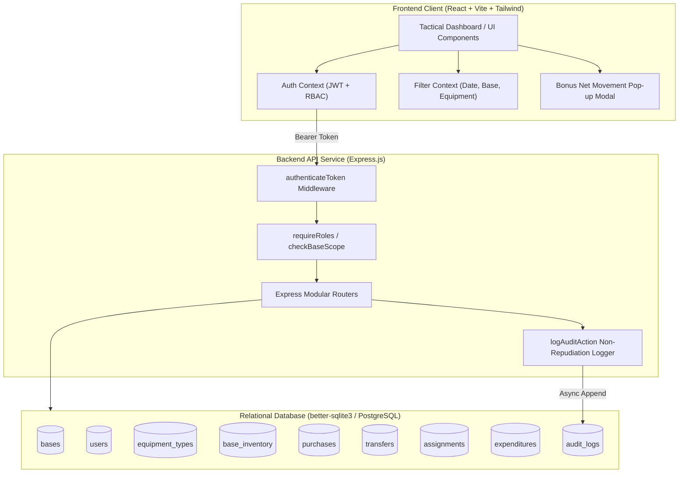
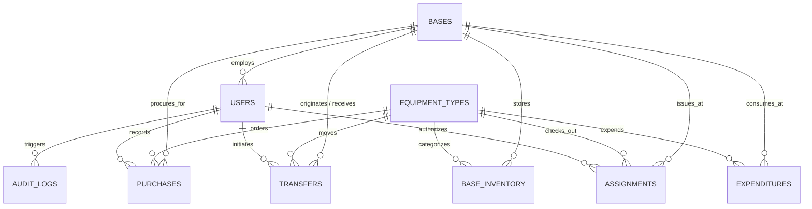

# Tactical Military Asset Management System (MAMS)
## System Architecture & Technical Project Documentation

---

### Executive Summary & Project Details

| Parameter | Specification |
| :--- | :--- |
| **System Name** | Vanguard Military Asset Management System (MAMS) |
| **Domain** | Defense Logistics, Multi-Base Asset Tracking, Personnel Armory Management |
| **Core Accounting Model** | Double-Entry Periodic Inventory Ledger with Non-Repudiation Audit Trail |
| **Classification** | UNCLASSIFIED // DEFENSE REQUISITION PROTOTYPE |
| **Version** | v2.4.0 (Production Ready) |

---

## 1. Project Overview

### 1.1 Description
The **Vanguard Military Asset Management System (MAMS)** is an enterprise defense logistics framework designed to provide military commanders, logistics officers, and defense administrators with total situational awareness and operational accountability over critical defense materiel. The system coordinates the tracking, procurement, inter-base redeployment, personnel assignment, and operational expenditure of assets (small arms, armored combat vehicles, guided missiles, munitions, tactical communications, and field trauma gear) across decentralized military installations.

### 1.2 Operational Motivation
Military logistics demands zero discrepancy between physical armory inventory and command records. Traditional static databases fail to preserve transaction history, creating supply vulnerabilities and audit failures. Vanguard MAMS enforces a **transactional ledger architecture**, ensuring:
- Instant mathematical balance reconciliation: $\text{Closing Balance} = \text{Opening Balance} + \text{Net Movement} - \text{Expended}$.
- Strict separation of duties via Role-Based Access Control (RBAC).
- Complete non-repudiation audit trails for every physical asset mutation.
- Live verification of available stock prior to transfers or personnel checkout.

### 1.3 Key Assumptions
1. **Base Topology**: The initial framework models four major tactical bases:
   - Fort Liberty (North Carolina, USA) - *Command Headquarters*
   - Camp Pendleton (California, USA) - *Pacific Amphibious Base*
   - Ramstein Air Base (Germany) - *European Logistics Hub*
   - Naval Station Norfolk (Virginia, USA) - *Fleet Support Armory*
2. **Double-Entry Periodic Movement**: All movements within a selected date window are accounted for strictly as:
   $$\text{Net Movement} = \text{Purchases} + \text{Transfers In} - \text{Transfers Out}$$
3. **Availability Semantics**: Available Stock is defined as $\max(0, \text{Closing Balance} - \text{Active Personnel Assignments})$.
4. **Time & Currency**: All transactions are indexed in UTC and financial valuations are expressed in USD.

### 1.4 Limitations
1. **Air-Gapped Sync**: The current prototype operates on an interconnected network; asynchronous distributed synchronization across offline air-gapped field units requires future satellite sync protocols.
2. **Serial Number Serialization**: High-value items (tanks, Javelins) use batch and serial registry; consumable ammunition is tracked in bulk crate/round batches.

---

## 2. Tech Stack & Architecture

### 2.1 Backend Stack & Justification
- **Runtime & Framework**: **Node.js (v24+)** with **Express.js (ES Modules)**.
  - *Justification*: Asynchronous, non-blocking I/O ideal for real-time logistics telemetry and concurrent ledger requests. Native ES module support provides modern, clean syntax.
- **Security & Middleware**:
  - `helmet`: Sets HTTP security headers (CSP, HSTS, X-Content-Type-Options).
  - `cors`: Configured for controlled cross-origin resource sharing.
  - `jsonwebtoken (JWT)`: Stateless, tamper-proof bearer token authentication with 24-hour expiration.
  - `bcryptjs`: Industry-standard salted password hashing (10 salt rounds).
  - `morgan`: Request tracing and diagnostic logging.

### 2.2 Frontend Stack & Justification
- **Framework & Tooling**: **React 18** with **Vite 6**.
  - *Justification*: Near-instant HMR (Hot Module Replacement), sub-second production builds via Rollup, and declarative component state management.
- **Styling & Design System**: **Tailwind CSS** with a custom tactical defense color palette (`slate-950`, `amber-400`, `emerald-400`, `cyan-400`, and `rose-400`).
- **Icons & Visuals**: **Lucide React** for crisp, military-grade vector iconography.
- **State Management**: React Context (`AuthContext`, `FilterContext`) ensuring global synchronization of active date ranges, base scoping, and RBAC clearances across all views without external state bloat.

### 2.3 Database Stack & Justification
- **Engine**: **Relational SQL via SQLite3 (`better-sqlite3`) & PostgreSQL ANSI Compatibility**.
  - *Why Relational SQL*: Defense logistics requires strict ACID guarantees. Inter-base transfers and purchases must never produce partial commits or phantom stock. Foreign key constraints (`ON DELETE RESTRICT`) ensure historical records are permanently preserved.
  - *Why `better-sqlite3`*: Synchronous execution prevents Node event loop deadlocks, operates with zero external service dependencies (guaranteeing 100% out-of-the-box evaluation without requiring local PostgreSQL Docker or system daemons), and writes to a single WAL-journaled file (`military_assets.db`).
  - *PostgreSQL Ready*: The SQL schema is 100% ANSI SQL standard and directly portable to PostgreSQL or MySQL via the included `database_dump.sql` and `render.yaml`.

### 2.4 System Architecture Diagram



---

## 3. Data Models / Schema

The schema enforces strict relational integrity with indexed lookup paths for high-frequency queries.

### 3.1 Entity Relationship Diagram



### 3.2 Core Table Specifications

1. **`bases`**: Military installations and garrison commands.
   - `id`: INTEGER PRIMARY KEY AUTOINCREMENT
   - `name`: TEXT NOT NULL (e.g. Fort Liberty)
   - `code`: TEXT UNIQUE NOT NULL (e.g. `BASE-LIBERTY`)
   - `location`: TEXT NOT NULL
   - `commander_name`: TEXT
   - `contact_email`: TEXT

2. **`equipment_types`**: Catalog of standardized military materiel.
   - `id`: INTEGER PRIMARY KEY AUTOINCREMENT
   - `name`: TEXT NOT NULL (e.g. M4A1 Tactical Carbine, M1A2 Abrams MBT)
   - `category`: TEXT NOT NULL CHECK(`category` IN ('Weapons', 'Vehicles', 'Ammunition', 'Communications', 'Medical & Field Gear'))
   - `unit`: TEXT NOT NULL (units, rounds, crates, kits)
   - `unit_cost_estimate`: REAL NOT NULL

3. **`users`**: Personnel credentials and security clearance profiles.
   - `id`: INTEGER PRIMARY KEY AUTOINCREMENT
   - `base_id`: INTEGER (FK `bases.id`, NULL for Global Admin)
   - `username`: TEXT UNIQUE NOT NULL
   - `email`: TEXT UNIQUE NOT NULL
   - `password_hash`: TEXT NOT NULL (Bcrypt salted)
   - `full_name`: TEXT NOT NULL
   - `role`: TEXT NOT NULL CHECK(`role` IN ('ADMIN', 'BASE_COMMANDER', 'LOGISTICS_OFFICER'))
   - `military_rank`: TEXT (General, Colonel, Captain, Major)

4. **`base_inventory`**: Baseline initial inventory quantity per base & equipment.
   - `id`: INTEGER PRIMARY KEY AUTOINCREMENT
   - `base_id`: INTEGER NOT NULL (FK `bases.id`)
   - `equipment_type_id`: INTEGER NOT NULL (FK `equipment_types.id`)
   - `initial_quantity`: INTEGER NOT NULL CHECK(initial_quantity >= 0)
   - `UNIQUE(base_id, equipment_type_id)`

5. **`purchases`**: Inbound procurement records from defense suppliers.
   - `id`: INTEGER PRIMARY KEY AUTOINCREMENT
   - `base_id`: INTEGER NOT NULL (FK `bases.id`)
   - `equipment_type_id`: INTEGER NOT NULL (FK `equipment_types.id`)
   - `quantity`: INTEGER NOT NULL CHECK(quantity > 0)
   - `unit_cost`: REAL NOT NULL
   - `total_cost`: REAL NOT NULL
   - `supplier`: TEXT NOT NULL (e.g. Colt Defense, Lockheed Martin)
   - `order_number`: TEXT UNIQUE NOT NULL
   - `purchase_date`: TEXT NOT NULL (YYYY-MM-DD)
   - `recorded_by_user_id`: INTEGER (FK `users.id`)

6. **`transfers`**: Inter-base hardware movement ledger.
   - `id`: INTEGER PRIMARY KEY AUTOINCREMENT
   - `tracking_number`: TEXT UNIQUE NOT NULL (e.g. `TRF-2026-8001`)
   - `origin_base_id`: INTEGER NOT NULL (FK `bases.id`)
   - `destination_base_id`: INTEGER NOT NULL (FK `bases.id`)
   - `equipment_type_id`: INTEGER NOT NULL (FK `equipment_types.id`)
   - `quantity`: INTEGER NOT NULL CHECK(quantity > 0)
   - `transfer_date`: TEXT NOT NULL (YYYY-MM-DD)
   - `reason`: TEXT NOT NULL
   - `priority`: TEXT NOT NULL CHECK(`priority` IN ('ROUTINE', 'STANDARD', 'URGENT', 'EMERGENCY'))
   - `status`: TEXT NOT NULL CHECK(`status` IN ('COMPLETED', 'IN_TRANSIT', 'CANCELLED'))
   - `initiated_by_user_id`: INTEGER (FK `users.id`)
   - `approved_by_user_id`: INTEGER (FK `users.id`)
   - `CHECK(origin_base_id <> destination_base_id)`

7. **`assignments`**: Personnel equipment checkouts and armory returns.
   - `id`: INTEGER PRIMARY KEY AUTOINCREMENT
   - `base_id`: INTEGER NOT NULL (FK `bases.id`)
   - `equipment_type_id`: INTEGER NOT NULL (FK `equipment_types.id`)
   - `personnel_name`: TEXT NOT NULL
   - `military_id`: TEXT NOT NULL (e.g. `US-7782109`)
   - `rank`: TEXT NOT NULL
   - `unit`: TEXT NOT NULL
   - `quantity`: INTEGER NOT NULL CHECK(quantity > 0)
   - `assigned_date`: TEXT NOT NULL
   - `expected_return_date`: TEXT
   - `return_date`: TEXT
   - `status`: TEXT NOT NULL CHECK(`status` IN ('ASSIGNED', 'RETURNED'))
   - `assigned_by_user_id`: INTEGER (FK `users.id`)

8. **`expenditures`**: Consumed, combat-lost, or decommissioned materiel.
   - `id`: INTEGER PRIMARY KEY AUTOINCREMENT
   - `base_id`: INTEGER NOT NULL (FK `bases.id`)
   - `equipment_type_id`: INTEGER NOT NULL (FK `equipment_types.id`)
   - `quantity`: INTEGER NOT NULL CHECK(quantity > 0)
   - `expenditure_type`: TEXT NOT NULL CHECK(`expenditure_type` IN ('TRAINING_EXERCISE', 'COMBAT_OPERATION', 'DECOMMISSIONED_DAMAGED', 'EXPIRED_CONSUMABLE', 'ROUTINE_EXPENDITURE'))
   - `date`: TEXT NOT NULL
   - `mission_reference`: TEXT NOT NULL
   - `approved_by_user_id`: INTEGER (FK `users.id`)

9. **`audit_logs`**: Tamper-evident transaction security trail.
   - `id`: INTEGER PRIMARY KEY AUTOINCREMENT
   - `timestamp`: DATETIME DEFAULT CURRENT_TIMESTAMP
   - `user_id`: INTEGER (FK `users.id`)
   - `user_name`: TEXT NOT NULL
   - `user_role`: TEXT NOT NULL
   - `action`: TEXT NOT NULL
   - `entity_type`: TEXT NOT NULL
   - `entity_id`: INTEGER
   - `base_id`: INTEGER
   - `details`: TEXT (JSON)
   - `ip_address`: TEXT
   - `status`: TEXT NOT NULL DEFAULT 'SUCCESS'

---

## 4. Role-Based Access Control (RBAC) Explanation

### 4.1 Role Hierarchy & Permissions Matrix

| Operational Feature | Admin (`ADMIN`) | Base Commander (`BASE_COMMANDER`) | Logistics Officer (`LOGISTICS_OFFICER`) |
| :--- | :---: | :---: | :---: |
| **Telemetry Scope** | Global (All 4 Bases) | Scoped to Assigned Installation | Scoped to Assigned Installation |
| **Command Dashboard** | Full Access + Base Comparison | Full Access for Base | Full Access for Base |
| **Net Movement Pop-up** | Full Access | Full Access | Full Access |
| **Record Purchases** | Authorized (Any Base) | Authorized (Assigned Base) | Authorized (Assigned Base) |
| **Initiate Transfers** | Authorized (Any Bases) | Authorized (Own Base = Origin/Dest) | Authorized (Own Base = Origin/Dest) |
| **Receive / Complete Transfers** | Authorized | Authorized | Authorized |
| **Assign Gear to Personnel** | Authorized | Authorized | **FORBIDDEN (HTTP 403)** |
| **Return Gear to Armory** | Authorized | Authorized | **FORBIDDEN (HTTP 403)** |
| **Record Asset Expenditure** | Authorized | Authorized | **FORBIDDEN (HTTP 403)** |
| **View Audit Trail Logs** | Full Global Audit Trail | Base-Scoped Audit Trail | **FORBIDDEN (HTTP 403)** |

### 4.2 Enforcement Architecture
1. **Backend Middleware Enforcement (`requireRoles`)**:
   - Routes check user clearance via `requireRoles('ADMIN', 'BASE_COMMANDER')`.
   - If a Logistics Officer requests `/api/assignments` or `/api/expenditures`, the middleware immediately terminates execution with HTTP 403 Forbidden.
2. **Base Scoping Enforcement (`checkBaseScope`)**:
   - Non-admin users are programmatically restricted: `req.body.base_id = req.user.base_id`.
   - Any attempt to forge request payloads targeting another base is intercepted and blocked.
3. **Frontend Guard Rails**:
   - Navigation links display lock indicators (`Limited Access`).
   - Assignment and expenditure forms are hidden or replaced with policy banners explaining RBAC clearance limitations.
4. **Fast Demo Role Switcher**:
   - A dedicated quick-switch menu in the top navigation bar allows evaluators to shift identities in 1 click, immediately demonstrating real-time RBAC policy enforcement.

---

## 5. API Logging & Audit Handling

### 5.1 Architecture
The system enforces **non-repudiation** through an automated audit logger (`logAuditAction`) that intercepts mutating business transactions:
- Every purchase order creation.
- Every inter-base dispatch and status update.
- Every personnel equipment issue and return.
- Every live-fire training or combat expenditure.
- Every user authentication success and security failure.

### 5.2 Recorded Metadata
Every audit record stores:
- `timestamp`: UTC ISO 8601 server timestamp.
- `user_id` & `user_name`: Identity of the commanding officer.
- `user_role`: Active role clearance during execution.
- `action`: Specific mutation event (e.g. `PURCHASE_CREATED`, `TRANSFER_INITIATED`, `ASSET_ASSIGNED`).
- `entity_type` & `entity_id`: Primary key of the affected business entity.
- `base_id`: Associated military base.
- `details`: Serialized JSON payload capturing quantities, serial numbers, supplier, costs, and reason codes.
- `ip_address`: Source client IPv4/IPv6 address.
- `status`: Execution status (`SUCCESS` or `FAILED`).

---

## 6. Setup Instructions

### 6.1 Prerequisites
- **Node.js**: v18.0.0 or higher (v20+ recommended; verified on Node v24)
- **npm**: v9.0.0 or higher
- **Operating System**: Windows, macOS, or Linux

### 6.2 Step-by-Step Installation

1. **Unpack Codebase**:
   Extract `military-asset-management-system.zip` into your desired working directory.

2. **Backend Setup**:
   ```bash
   cd backend
   npm install
   npm run seed
   ```
   *Note: `npm run seed` creates the SQLite database, executes the complete DDL schema, and populates all 4 bases, equipment types, user accounts, and historical transactions.*

3. **Frontend Setup**:
   ```bash
   cd ../frontend
   npm install
   npm run build
   ```

4. **Launch Application**:
   - **Terminal 1 (Backend Server)**:
     ```bash
     cd backend
     npm start
     # Server active on http://localhost:5001
     ```
   - **Terminal 2 (Frontend Dev Server)**:
     ```bash
     cd frontend
     npm run dev
     # Client accessible on http://localhost:3000
     ```

5. **Access Web Application**:
   Open browser to `http://localhost:3000`.

---

## 7. Key API Endpoints & Contracts

### 7.1 Authentication
- **`POST /api/auth/login`**:
  - Request: `{"username": "admin", "password": "Admin@1234"}`
  - Response: `{ "success": true, "token": "<JWT_TOKEN>", "user": { "id": 1, "username": "admin", "role": "ADMIN" } }`
- **`POST /api/auth/demo-switch`**:
  - Request: `{"role": "BASE_COMMANDER", "base_id": 1}`
  - Response: Pre-signed JWT token and user profile for immediate testing.

### 7.2 Dashboard & Metrics
- **`GET /api/dashboard/metrics?startDate=2026-09-01&endDate=2026-09-25&baseId=1`**:
  - Response:
    ```json
    {
      "success": true,
      "metrics": {
        "openingBalance": 2420,
        "closingBalance": 2697,
        "netMovement": 330,
        "purchases": { "quantity": 360, "count": 3, "totalCost": 403500 },
        "transfersIn": { "quantity": 50, "count": 1 },
        "transfersOut": { "quantity": 34, "count": 2 },
        "expended": { "quantity": 53, "count": 3 },
        "assigned": { "quantity": 6, "count": 3 },
        "availableStock": 2691
      }
    }
    ```
- **`GET /api/dashboard/net-movement-details?baseId=1`** (Bonus Pop-up):
  - Returns complete itemized arrays of `purchases`, `transfersIn`, and `transfersOut` along with mathematical verification summary.

### 7.3 Procurement & Transfers
- **`POST /api/purchases`**:
  - Headers: `Authorization: Bearer <TOKEN>`
  - Request:
    ```json
    {
      "base_id": 1,
      "equipment_type_id": 1,
      "quantity": 50,
      "unit_cost": 1200,
      "supplier": "Colt Defense LLC",
      "order_number": "PO-2026-9021",
      "purchase_date": "2026-09-25",
      "notes": "Emergency reinforcement stock"
    }
    ```
  - Response: HTTP 201 Created with purchase record.
- **`POST /api/transfers`**:
  - Validates source base has sufficient unassigned stock:
    ```json
    {
      "origin_base_id": 1,
      "destination_base_id": 2,
      "equipment_type_id": 1,
      "quantity": 20,
      "transfer_date": "2026-09-25",
      "reason": "Amphibious battalion readiness exercise",
      "priority": "URGENT",
      "status": "COMPLETED"
    }
    ```

### 7.4 Assignments & Expenditures
- **`POST /api/assignments`** (Requires Admin or Base Commander):
  - Assigns rifle or night vision goggles to named personnel with military ID.
- **`PATCH /api/assignments/:id/return`**:
  - Marks item as returned, restoring available armory stock.
- **`POST /api/expenditures`**:
  - Records ammunition fired or damaged hardware.

### 7.5 Audit Trail
- **`GET /api/audit-logs`**:
  - Returns paginated audit trail filtered by date, base, action, and user.

---

## 8. Working Login Credentials

The following credentials are pre-seeded and verified. You can also use the **Quick Demo Switcher** directly from the login page or top navigation bar.

| Callsign / Username | Password | Full Name & Military Rank | Assigned Installation | Security Role & Privileges |
| :--- | :--- | :--- | :--- | :--- |
| **`admin`** | `Admin@1234` | Gen. Arthur Kane (General) | **Global Strategic HQ** *(All Installations)* | **ADMIN**: Unrestricted global visibility across all bases, procurement, transfers, assignments, and audit logs. |
| **`commander_liberty`** | `Commander@1234` | Col. Marcus Vance (Colonel) | **Fort Liberty, NC** | **BASE_COMMANDER**: Installation command of Fort Liberty assets, assignments, expenditures, purchases, transfers, and armory. |
| **`commander_pendleton`** | `Commander@1234` | Col. Sarah Jenkins (Colonel) | **Camp Pendleton, CA** | **BASE_COMMANDER**: Installation command of Camp Pendleton marine expeditionary forces. |
| **`logistics_liberty`** | `Logistics@1234` | Capt. Ray Miller (Captain) | **Fort Liberty Logistics** | **LOGISTICS_OFFICER**: Supply chain officer. Can record purchases and transfers. Restricted from personnel assignments. |
| **`logistics_ramstein`** | `Logistics@1234` | Maj. Elena Rostova (Major) | **Ramstein Air Base (Germany)** | **LOGISTICS_OFFICER**: European theater supply chain officer. Manages rapid purchases and airbase transfers. |
